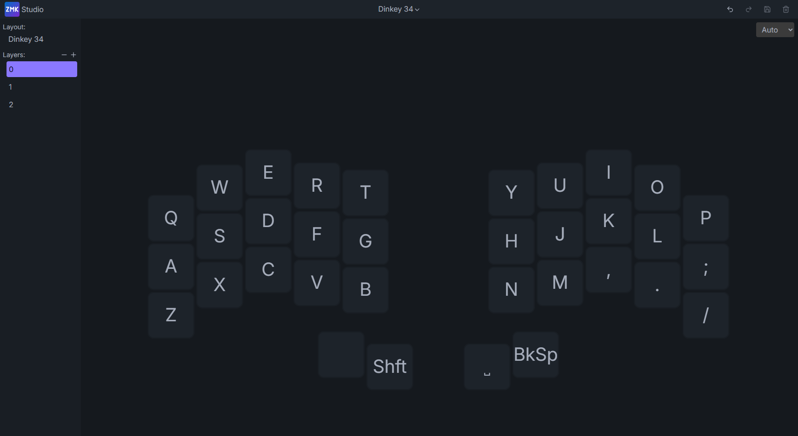

# Dinkey 34 — ZMK Firmware

ZMK firmware config for the Dinkey 34. Runs on the nice!nano v2 with optional nice!view display.

---

## Hardware

- **MCU:** nice!nano v2 (hotswap socket)
- **Display:** nice!view (optional, hotswap)
- **Switches:** Kailh Choc v1 hotswap
- **Layout:** 3×5+2 split, 34 keys

---

## Flashing

Each build produces three `.uf2` files:

| File | What it's for |
|---|---|
| `dinkey34_left-...uf2` | Left half |
| `dinkey34_right-...uf2` | Right half |
| `settings_reset-...uf2` | Clears BT pairing data |

Download the latest from the **Actions** tab → most recent run → **Artifacts**.

**To flash:**
1. Unzip the artifact
2. Plug in the left half via USB
3. Double-tap the reset button on the nice!nano — it'll show up as a `NICENANO` drive
4. Drag `dinkey34_left-...uf2` onto the drive
5. Repeat for the right half

Flash the left first. The right connects to the left over BLE.

**To reset Bluetooth pairing:**
Flash `settings_reset-...uf2` to both halves, then reflash normal firmware.

---

## ZMK Studio

No code required. ZMK Studio lets you remap keys visually in your browser.



**What you need:**
- Left half connected via USB
- Chrome or Edge (Chromium-based)
- [studio.zmk.dev](https://studio.zmk.dev)

**Steps:**
1. Plug in the left half
2. The board defaults to BLE. Switch to USB output by pressing the output toggle on Layer 2
3. Open [studio.zmk.dev](https://studio.zmk.dev) and click Connect
4. Select the Dinkey 34 from the device list
5. Press **Q + P** at the same time to unlock Studio (top outer keys, positions 0 and 9)
6. Remap away — changes save to the keyboard automatically

---

## Default Layout

Layer 0 — Base

```
┌───┬───┬───┬───┬───┐   ┌───┬───┬───┬───┬───┐
│ Q │ W │ E │ R │ T │   │ Y │ U │ I │ O │ P │
├───┼───┼───┼───┼───┤   ├───┼───┼───┼───┼───┤
│ A │ S │ D │ F │ G │   │ H │ J │ K │ L │ ; │
├───┼───┼───┼───┼───┤   ├───┼───┼───┼───┼───┤
│ Z │ X │ C │ V │ B │   │ N │ M │ , │ . │ / │
└───┴───┴───┼───┼───┤   ├───┼───┼───┴───┴───┘
            │SFT│ENT│   │BSP│SPC│
            └───┴───┘   └───┴───┘
```

3 layers total. Layer 2 has Bluetooth profile switching, BT clear, and the output toggle (BLE ↔ USB).

---

## Repo Structure

```
config/
  boards/shields/dinkey34/
    dinkey34.dtsi            ← Row/col pin definitions for the 34 PCB
    dinkey34_left.overlay    ← Left half wiring
    dinkey34_right.overlay   ← Right half wiring
    dinkey34.zmk.yml
    Kconfig.shield
    Kconfig.defconfig
  dinkey34.keymap
  dinkey34.conf
build.yaml
```

---

## Building Locally

```bash
west build -s app -b nice_nano/nrf52840/zmk \
  -d build/left \
  -- -DSHIELD="dinkey34_left nice_view_adapter nice_view" \
     -DCONFIG_ZMK_STUDIO=y \
     -DSNIPPET=studio-rpc-usb-uart
```

Studio is enabled on the left half only.

---

## Related

- [Dinkey 32|30 ZMK config](https://github.com/IdleBuilds/zmk-config-dinkey_32_30)
- [Main repo](https://github.com/IdleBuilds/Dinkey)
- [idlebuilds.com](https://idlebuilds.com)
- [ZMK docs](https://zmk.dev/docs) · [ZMK Studio](https://studio.zmk.dev)
